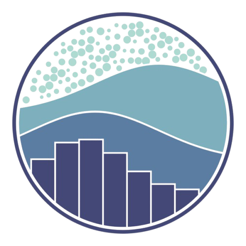
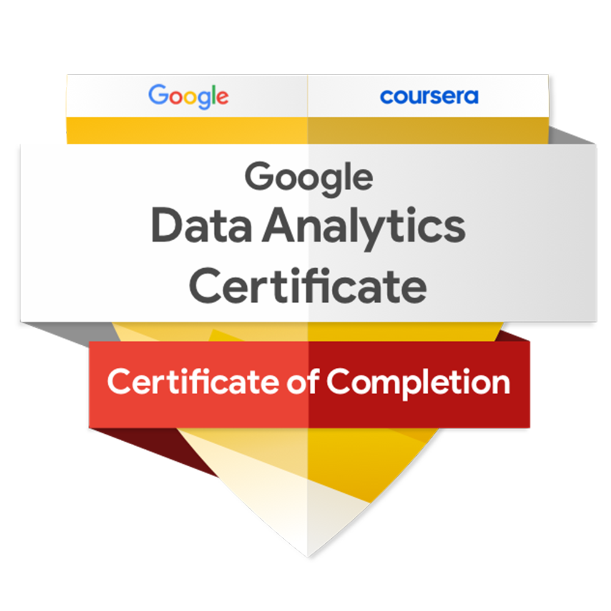

<table>
<tr>
<td>

<h1>Hi 👋, I'm Navina</h1>
<h4>Investigation Associate @ Amazon | Aspiring Data Analyst</h4>
<h4><i>Turning raw data into actionable insights that support decision-making and business growth</i></h4>

  <a href="Resume/Navina_DataAnalyst.pdf" target="_blank" style="text-decoration:none; font-weight:bold; font-size:16px;">
    📄View My Resume
  </a>

</td>
<td>
  
</td>
</tr>
</table>

---

- 👩‍💼 **Currently working in Product Quality (PQ) at Amazon**, safeguarding brands through investigations.  
- 📊 **Building a strong foundation in Data Analytics & Visualization.**  
- 🛠️ **Skilled with SQL, Python, Excel, Power BI, and Tableau.**  
- 👨‍💻 **Projects available here:** [My Portfolio](https://navina-murugadas.github.io/Portfolio/)  
- 📚 **Continuously expanding expertise in Advanced Analytics & Machine Learning.**  
- 📫 **Reach me at:** navina.mk7@gmail.com  

---

## 🛠️ Languages and Tools  

  <!-- MySQL -->
  
  <!-- PowerBI -->
  
  <!-- Python -->
  
  <!-- Tableau -->
  
  <!-- Excel -->
  
  <!-- Snowflake -->
  
  <!-- Pandas -->
  
  <!-- Seaborn -->
  
  <!-- HCJ -->
  
  <!-- Jupyter -->
  
  <!-- Pycharm -->
  
  <!-- VSC -->
  
  

---

## 🎓 Certifications/Badges

  
  <!-- Google Data Analytics -->
  

  <!-- IBM Data Science -->
  

  <!-- Cisco Data Analytics Essentials -->
  

---

## 📌 Featured Projects  

- 📊 [**Yelp Business Reviews Analysis**](https://github.com/Navina-Murugadas/Yelp_Business_Review_Analysis) – End-to-end pipeline on **7M Yelp reviews** using Python, Snowflake & Power BI for business, category, and sentiment insights.  
- 🏥 [**Insurance Data Analysis**](https://github.com/Navina-Murugadas/Insurance_Data_Analysis) – **Power BI dashboard** analyzing 5 years of insurance data (premiums, claims & demographics).  
- 🛒 [**Superstores Sales Analysis**](https://github.com/Navina-Murugadas/Superstores_Tableau) – **Tableau dashboard** on sales, profitability & customer behavior (2020–2023).  
- 🍏 [**Apple Store Sales Analysis**](https://github.com/Navina-Murugadas/Apple_Global_Sales_Analysis) – **Excel dashboard** exploring Apple’s sales trends, product performance & regional growth (2018–2022).  

---

<h3 align="left">🌐 Connect with me:</h3>

---

